# Hyperax Architecture Diagrams

## 1. System Overview

```mermaid
graph TB
    subgraph External["External Channels"]
        AMAIL[AgentMail API]
        IMAP[IMAP/SMTP]
        SLACK[Slack]
        DISCORD[Discord]
        WEBHOOK[Webhooks]
    end

    subgraph Clients["AI Agent Clients / Users"]
        CLAUDE[Claude Code]
        CURSOR[Cursor]
        COPILOT[Copilot]
        DASH[Web Dashboard]
        CLI[CLI]
    end

    subgraph Core["Hyperax Core (Single Binary)"]

        subgraph Transport["Transport Layer"]
            MCP_SSE["MCP SSE\n/mcp/sse"]
            MCP_HTTP["MCP Streamable HTTP\nPOST /mcp"]
            WS["WebSocket\n/ws/events"]
            REST["REST API\n/api/v1/"]
        end

        subgraph Security["Security Layer"]
            AUTH["Auth\nEd25519 JWT"]
            ABAC["ABAC\n4-Tier Clearance"]
            GUARD["Guard System\nAction Approval"]
            RATE["Rate Limiter\nPer-IP"]
        end

        subgraph CommLayer["Communication Governance"]
            COMMHUB["CommHub"]
            SIEVE["Context Sieve\n5 Layers"]
            INBOXES["Agent Inboxes\nPer-Agent Channels"]
            OVERFLOW["Overflow\nPersistence"]
            HIERARCHY["Hierarchy\nEnforcement"]
        end

        subgraph MCP_Server["MCP Server (16 Tools)"]
            REGISTRY["Tool Registry"]
            DISPATCH["Action Dispatch"]
            HANDLERS["Handler Domains\nworkspace | project | doc | pipeline\naudit | code | config | agent\nobservability | memory | secret\nrefactor | event | comm | governance | plugin"]
        end

        subgraph Agentic["Agentic Execution"]
            BRIDGE["Tool-Use Bridge"]
            RESOLVER["Tool Resolver\nABAC-Filtered"]
            EXECUTOR["Executor Loop\nMax 100 iterations"]
            ADAPTERS["Provider Adapters\nAnthropic | OpenAI | Google\nBedrock | Azure | Ollama"]
        end

        subgraph Intelligence["Code Intelligence"]
            INDEXER["AST Indexer\nTree-sitter"]
            SEARCH["Hybrid Search\nBM25 + Vector + RRF"]
            SENTINEL["File Sentinel\nfsnotify"]
            CACHE["Symbol Cache"]
        end

        subgraph Temporal["Temporal Orchestration"]
            PULSE["Pulse Engine\nCadence Scheduler"]
            CRON["Cron System"]
            WATCHDOG["Watchdog\nFail-Closed"]
            SENSOR["Sensor Manager"]
        end

        subgraph Safety["Safety Systems"]
            INTERJECT["Interjection Manager\nAndon Cord"]
            BUDGET["Budget Monitor\nPer-Provider"]
            ALERTS["Alert Evaluator"]
        end

        subgraph Nervous["Nervous System"]
            EVENTBUS["EventBus\nLamport Clock"]
            RINGBUF["Ring Buffer\n10K Events"]
            TRANSPORT_S["Transport Stream\nEphemeral"]
            DOMAIN_S["Domain Stream\nPersisted"]
        end

        subgraph Lifecycle["Agent Lifecycle"]
            FSM["FSM Manager\n9 States"]
            ONBOARD["Onboarding\n4-Step Sequence"]
            CHECKPOINT["Checkpointing"]
            REHYDRATE["Rehydration"]
        end

        subgraph Plugins["Plugin System"]
            PLUGMGR["Plugin Manager"]
            SUBPROCESS["MCP Subprocess"]
            BRIDGES["Bridges\nSecret | Guard | Audit"]
            CATALOG["Plugin Catalog"]
        end

        subgraph Context["Context Economics"]
            COMPACTOR["Conversation\nCompactor"]
            HINTS["Tool Hints\nPrompt Queue"]
            SUPERCTX["Super Context\nAgent File Gen"]
        end

        subgraph Storage["Storage Layer"]
            STORE["Store Facade\n30 Repos"]
            SQLITE[(SQLite)]
            PG[(PostgreSQL)]
            MYSQL[(MySQL)]
            MIGRATE["Migration Runner\n43 Migrations"]
        end

        subgraph Frontend["Embedded Frontend"]
            REACT["React 18 + Vite\ngo:embed"]
        end
    end

    %% Client connections
    CLAUDE & CURSOR & COPILOT -->|MCP JSON-RPC| MCP_SSE & MCP_HTTP
    DASH -->|WebSocket + MCP| WS & MCP_HTTP
    CLI -->|REST| REST

    %% External channels
    AMAIL & IMAP & SLACK & DISCORD & WEBHOOK -->|TrustExternal| SIEVE

    %% Transport → Security → MCP
    MCP_SSE & MCP_HTTP --> AUTH
    AUTH --> ABAC
    ABAC --> GUARD
    GUARD --> DISPATCH

    %% MCP dispatch
    DISPATCH --> REGISTRY
    REGISTRY --> HANDLERS

    %% CommHub flow
    SIEVE --> COMMHUB
    COMMHUB --> HIERARCHY
    COMMHUB --> INBOXES
    INBOXES -->|Full| OVERFLOW
    COMMHUB -->|Envelope| BRIDGE

    %% Agentic loop
    BRIDGE --> RESOLVER
    RESOLVER --> EXECUTOR
    EXECUTOR --> ADAPTERS
    EXECUTOR -->|Tool Call| DISPATCH
    ADAPTERS -->|LLM API| LLM_PROVIDERS["LLM Providers\nAnthropic | OpenAI | Google\nAWS Bedrock | Ollama"]

    %% Intelligence
    SENTINEL --> INDEXER
    INDEXER --> SEARCH
    SEARCH --> CACHE

    %% Temporal
    PULSE --> COMMHUB
    PULSE --> WATCHDOG
    CRON --> PULSE
    SENSOR --> PULSE

    %% Safety
    WATCHDOG -->|Stall| INTERJECT
    BUDGET -->|Threshold| INTERJECT
    ALERTS --> INTERJECT
    INTERJECT -->|Safe Mode| COMMHUB
    INTERJECT -->|Suspend| PULSE

    %% Nervous System
    EVENTBUS --> RINGBUF
    RINGBUF --> WS
    EVENTBUS --> TRANSPORT_S
    TRANSPORT_S -->|Promote| DOMAIN_S

    %% Lifecycle
    FSM --> ONBOARD
    ONBOARD --> COMMHUB
    FSM --> CHECKPOINT
    CHECKPOINT --> REHYDRATE

    %% Plugins
    PLUGMGR --> SUBPROCESS
    PLUGMGR --> BRIDGES
    PLUGMGR --> CATALOG
    SUBPROCESS -->|JSON-RPC| REGISTRY

    %% Storage
    STORE --> SQLITE
    STORE --> PG
    STORE --> MYSQL
    MIGRATE --> STORE

    %% Frontend
    REACT -->|mcpCall| MCP_HTTP
    REACT -->|Events| WS

    %% Event publishing (all subsystems → EventBus)
    COMMHUB -.->|Events| EVENTBUS
    PULSE -.->|Events| EVENTBUS
    INTERJECT -.->|Events| EVENTBUS
    BRIDGE -.->|Events| EVENTBUS
    FSM -.->|Events| EVENTBUS
    SENTINEL -.->|fs.*| EVENTBUS

    classDef external fill:#f9f,stroke:#333
    classDef client fill:#bbf,stroke:#333
    classDef security fill:#fbb,stroke:#333
    classDef storage fill:#bfb,stroke:#333

    class AMAIL,IMAP,SLACK,DISCORD,WEBHOOK external
    class CLAUDE,CURSOR,COPILOT,DASH,CLI client
    class AUTH,ABAC,GUARD,RATE security
    class SQLITE,PG,MYSQL storage
```

## 2. MCP Request Lifecycle

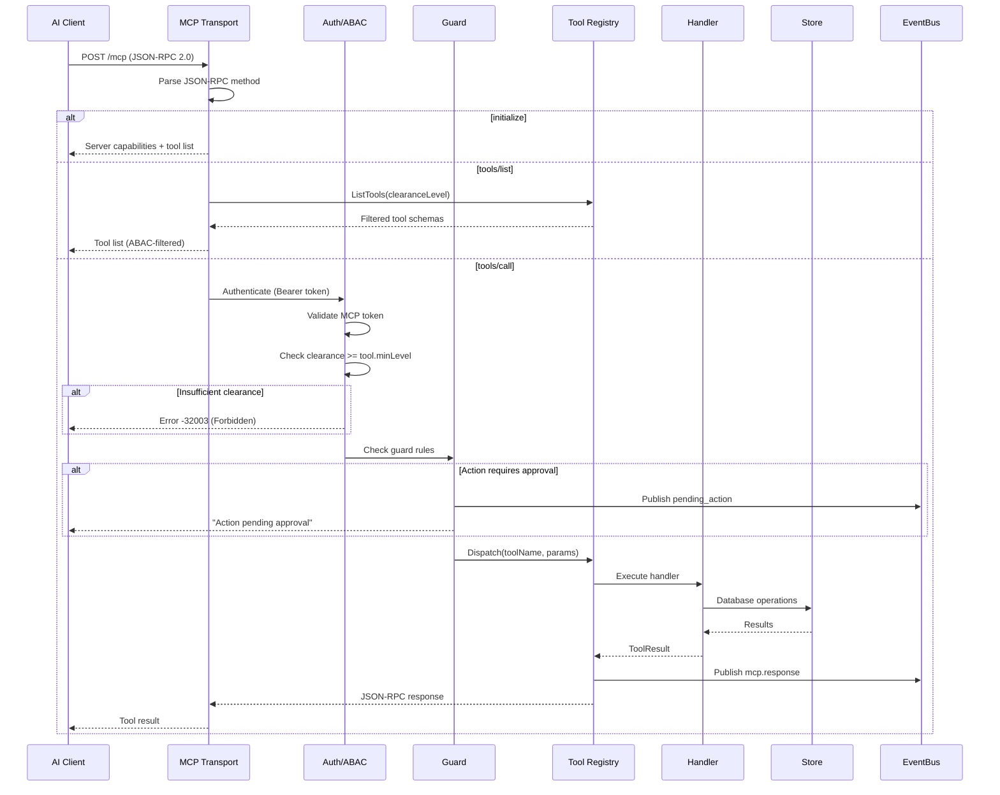

## 3. Chat Completion & Tool-Use Loop

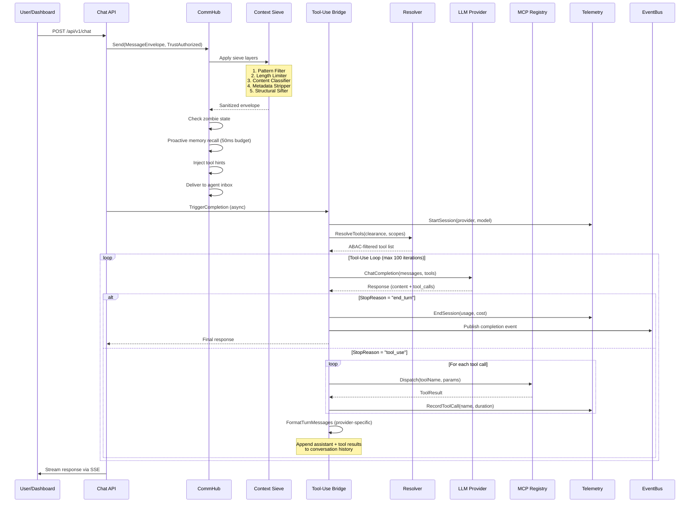

## 4. Communication Governance (CommHub)

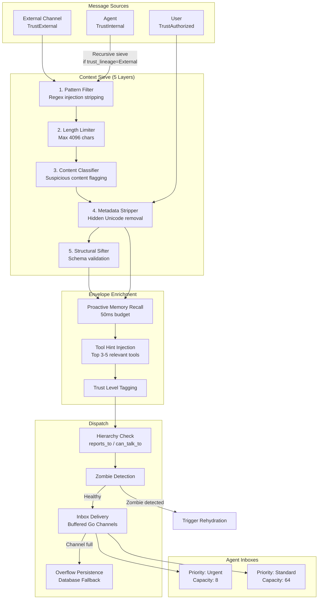

## 5. Agent Lifecycle (FSM)

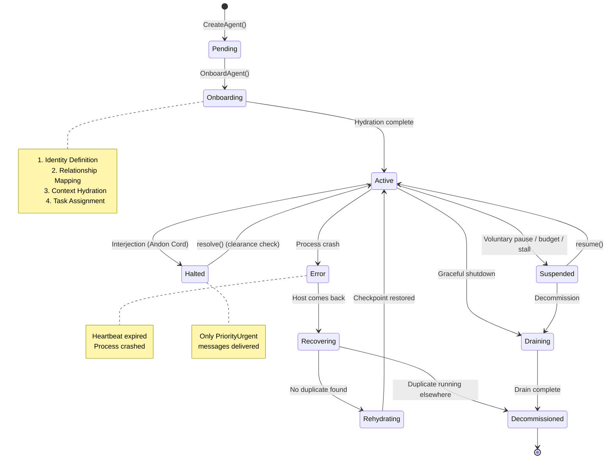

## 6. Storage Architecture

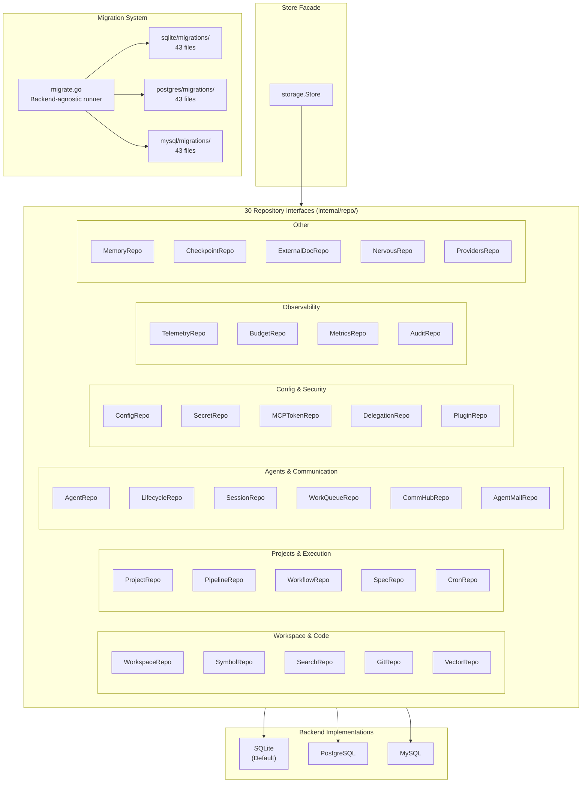

## 7. Security Model (ABAC + Guard)

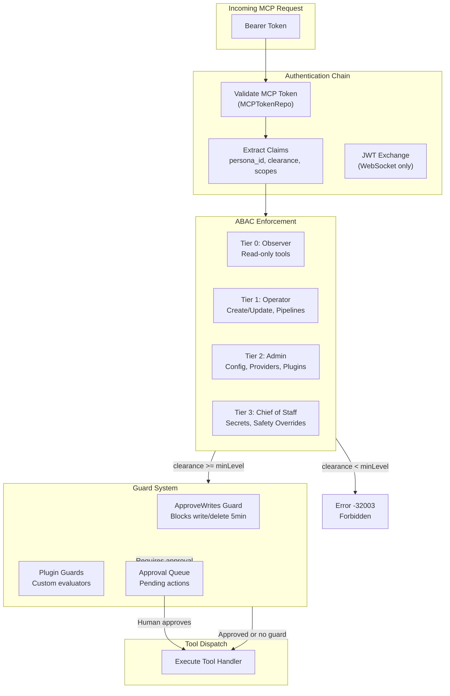

## 8. Nervous System (Event Architecture)

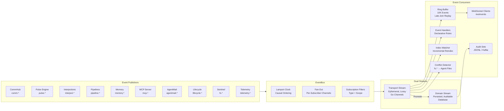

## 9. Plugin System

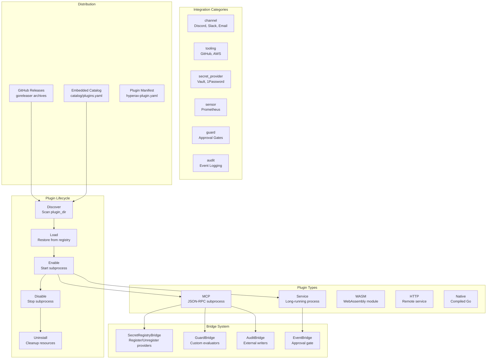

## 10. Deployment Architecture

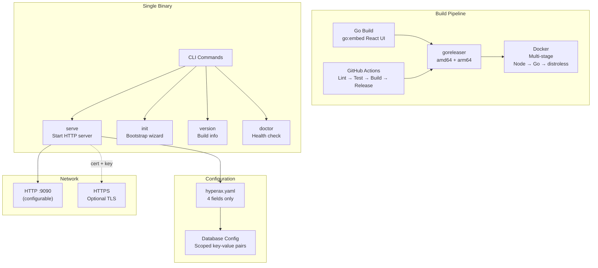

## 11. Data Flow: Pipeline Execution

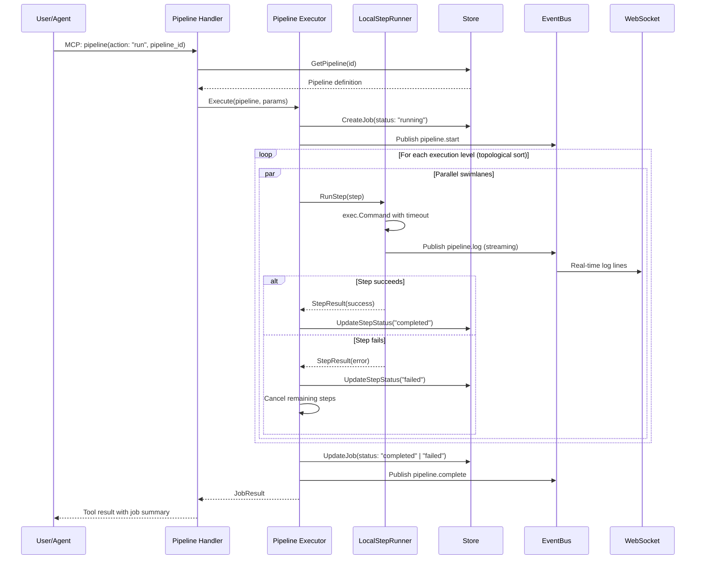

## 12. Interjection System (Andon Cord)

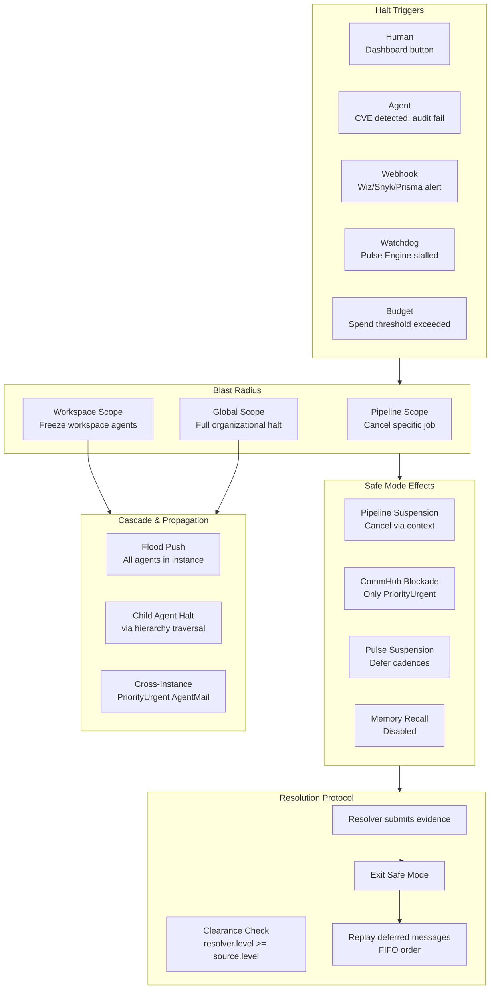

## 13. Provider Adapter Architecture

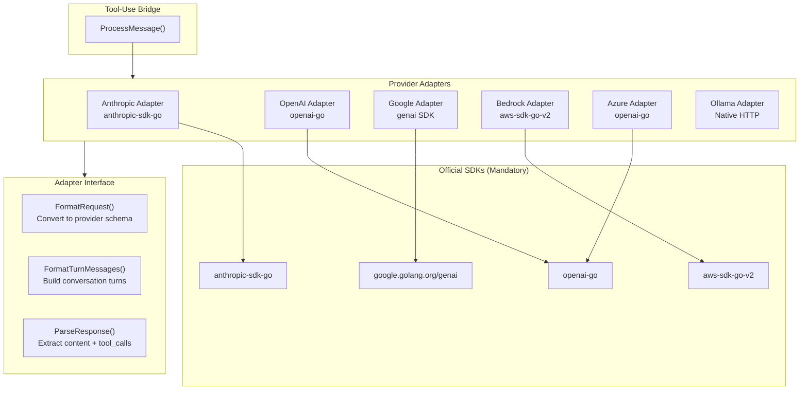

## 14. Frontend Architecture

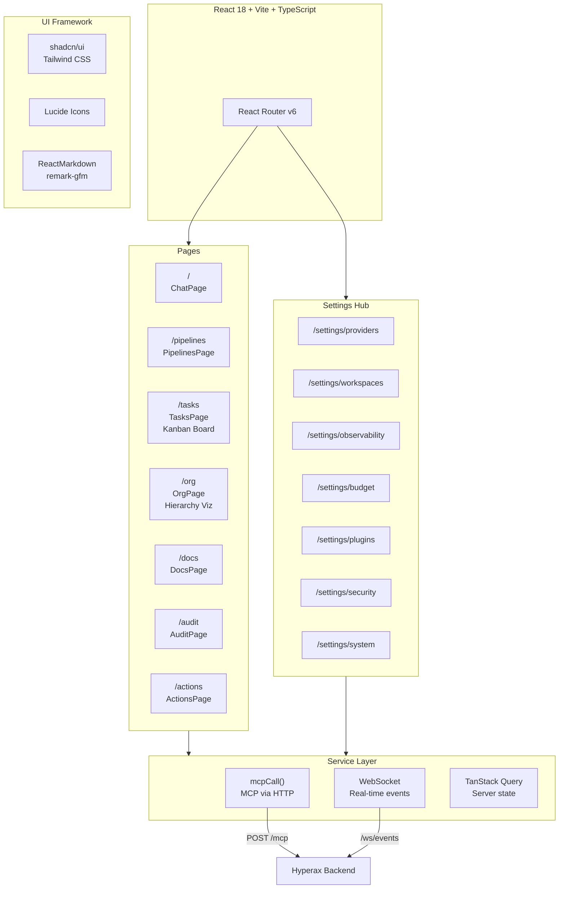
